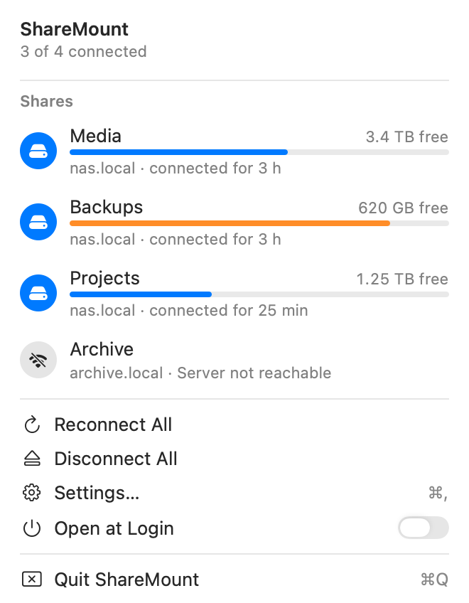
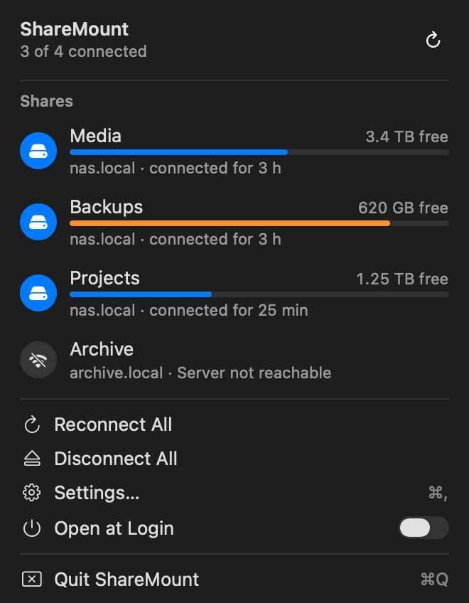
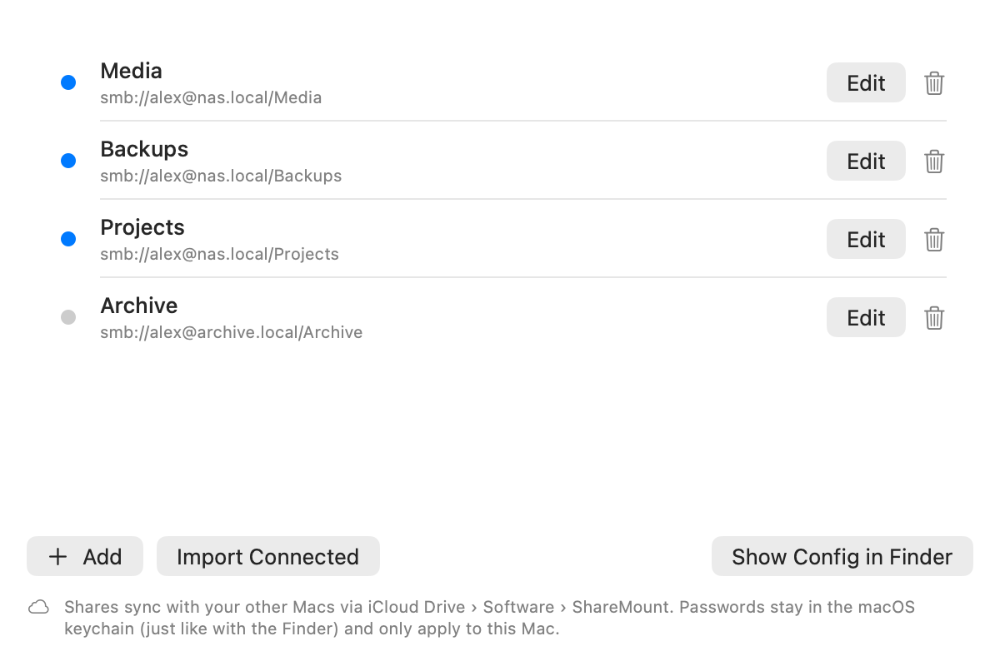

<p align="center">
  
</p>

<h1 align="center">ShareMount</h1>

<p align="center">
  A small macOS menu bar app that keeps your SMB shares mounted.<br>
  It reconnects them after sleep, network changes and NAS restarts, using the passwords macOS already keeps for the Finder.
</p>

<p align="center">
  <a href="https://github.com/SH1FT-W/sharemount/releases/latest">Download</a> ·
  <a href="https://sh1ft-w.github.io/sharemount/">Website</a> ·
  <a href="#install">Install</a> ·
  <a href="#faq">FAQ</a>
</p>

<p align="center">
  
  &nbsp;
  
</p>

> **Language:** English and German, following your Mac's preferred language. The screenshots use demo data.

## Why

macOS mounts a network share once and then forgets about it. After the Mac wakes up, switches Wi-Fi or the NAS reboots, the share is gone, or worse, it hangs and the Finder beachballs. Scripts and backups that expect `/Volumes/Media` suddenly find `/Volumes/Media-1`. ShareMount watches your shares and quietly fixes all of that.

## Features

- **Stays connected.** Checks at launch, after wake, on every network change and on a timer (every minute by default). Lost shares come back on their own, with a growing back-off from 30 seconds to 15 minutes while a server is away.
- **Detects hung mounts.** A share counts as dead only if the server stops answering on port 445 or reading the folder hangs for more than 10 seconds, twice in a row. Then it is unmounted and mounted again. Right after wake or a network change it never unmounts anything.
- **Clean paths.** Keeps shares at `/Volumes/<name>` instead of `/Volumes/<name>-1`, and tells you if a leftover folder is in the way.
- **No passwords of its own.** ShareMount mounts through macOS (NetFS and NetAuth), which takes the password from the same keychain entry the Finder creates when you tick *Remember this password in my keychain*. The app never reads or stores your passwords.
- **Safe with wrong passwords.** If a server rejects the login, ShareMount stops retrying until you sign in again, so your NAS account is not locked out.
- **Native menu.** Designed like the Wi-Fi and Bluetooth menus of macOS 26 and 27, with free space per share, connection time and one-click open, disconnect or reconnect.
- **Easy setup.** Add shares by hand, pick a server found via Bonjour, paste an `smb://` address, or adopt shares that are already mounted in the Finder.
- **Syncs between your Macs.** With iCloud Drive, the list of shares (not the passwords) is shared between all your Macs.
- **Notifications** when a share is lost, a password is rejected or an update is available, at most once every 10 minutes per share.
- **Updates from GitHub Releases**, verified before anything is replaced (see [Updates](#updates)).

<p align="center">
  
</p>

## Install

### Requirements

- macOS 14 Sonoma or later (built and tested on macOS 27)
- A Mac with Apple silicon. Intel Macs are not supported.

### Download

1. Download `ShareMount.zip` from the [latest release](https://github.com/SH1FT-W/sharemount/releases/latest) and unzip it.
2. Move `ShareMount.app` to your **Applications** folder. Updates can only replace the app from there.
3. **First launch:** ShareMount is open source but not notarized by Apple (that needs a paid developer account), so macOS blocks the first launch. Allow it once, either way:
   - Open **System Settings › Privacy & Security**, scroll down to *“ShareMount” was blocked* and click **Open Anyway**; or
   - in Terminal:
     ```sh
     xattr -dr com.apple.quarantine /Applications/ShareMount.app
     ```
   On macOS 14 you can also right-click the app and choose **Open**.
4. A drive icon appears in the menu bar. There is no Dock icon.

### First run

1. Open the menu and choose **Settings…**, then **Add**, or **Import Connected** to adopt shares you already mounted in the Finder.
2. If macOS has no password for a share yet, click the share (or **Sign In…**). The standard macOS login window appears; tick **Remember this password in my keychain**. From then on ShareMount connects without asking.
3. Allow notifications and, if asked, access to the local network.
4. Turn on **Open at Login** in the menu.

### Build from source

No Xcode needed, the Command Line Tools are enough (`xcode-select --install`).

```sh
git clone https://github.com/SH1FT-W/sharemount.git
cd sharemount
./build.sh            # builds build/ShareMount.app (arm64, ad-hoc signed)
./build.sh install    # copies it to /Applications and launches it
./build.sh test       # runs the self tests
./build.sh snapshot   # renders the screenshots in docs/screenshots with demo data
```

`build.sh` prefers a macOS 26 SDK from the Command Line Tools (the SDK 27 there lacks the SwiftUI macro plugin) and falls back to the default SDK. Override with `SDK=/path/to/sdk ./build.sh`. Only Apple frameworks are used, no third-party code.

## Updates

ShareMount checks the [GitHub releases](https://github.com/SH1FT-W/sharemount/releases) of this repository shortly after launch and every 6 hours (you can turn that off). When a new version is out, a small window offers *Install now*, *Later* or *Skip this version*.

Before the app is replaced, ShareMount checks that the download matches the published SHA-256 checksum, that it is ShareMount (bundle identifier) with exactly the announced version, and that its code signature is intact. The new version then replaces the old one in place; if that fails, the old version is put back.

Because ShareMount is ad-hoc signed and the checksum is published in the same release, these checks protect against broken or mixed-up downloads. They cannot protect against a compromised GitHub account, so an update is exactly as trustworthy as this repository's releases.

No GitHub account or token is needed. A read-only token can be entered under *Settings › Updates › GitHub Token (optional)*, which is only useful for a private fork.

## Privacy

- **No tracking.** No analytics, no telemetry, no accounts.
- **Network:** ShareMount talks to your own SMB servers (a quick check on port 445, then the mount), browses for SMB servers via Bonjour on your local network while the share editor is open, and asks `api.github.com` for new releases. Nothing else.
- **Passwords** stay in the macOS keychain and are only used by macOS itself.
- **Your list of shares** (server, share name, user name) is stored as `shares.json` in iCloud Drive › Software › ShareMount when iCloud Drive is on, otherwise in `~/Library/Application Support/ShareMount`. The log is at `~/Library/Logs/ShareMount.log`.

## FAQ

**A share shows “Server not reachable” although the NAS is on.**
Check *System Settings › Privacy & Security › Local Network* and make sure ShareMount is allowed. VPNs and firewalls that block port 445 have the same effect.

**The login is rejected (key icon).**
ShareMount deliberately stops retrying so your NAS does not lock the account. Click the share, enter the correct password in the macOS window and tick *Remember this password in my keychain*.

**My share is mounted at `/Volumes/Name-1`.**
That happens when macOS had not finished removing the old mount. ShareMount fixes it right after its own mounts. For an existing mount it shows *Fix Path* in the menu, because a running app might have files open there. If an empty folder blocks the path, the menu shows the `sudo rmdir` command to remove it.

**Does it work with Time Machine shares?**
Yes. ShareMount ignores the hidden mounts Time Machine creates under `/Volumes/.timemachine`.

**How do I uninstall it?**
Quit ShareMount, delete it from Applications, and optionally remove the `ShareMount` folder in iCloud Drive › Software or `~/Library/Application Support`, and `~/Library/Logs/ShareMount.log`. The keychain entries belong to macOS and the Finder and stay where they are.

**Which languages are supported?**
English and German. The app picks German when your Mac's first preferred language is German and English otherwise. To try the other language, start it from Terminal with `SHAREMOUNT_LANG=en` or `SHAREMOUNT_LANG=de`, for example `SHAREMOUNT_LANG=en /Applications/ShareMount.app/Contents/MacOS/ShareMount`.

## How it works

| File | What it does |
|---|---|
| `Sources/Engine.swift` | When to check: launch, wake, network changes, timer; back-off; dead-mount detection; path fixes |
| `Sources/Mounter.swift` | Mount (NetFS, soft mount, no dialogs), probe, unmount, all with timeouts |
| `Sources/Keychain.swift` | Where a password lives (macOS keychain via NetAuth, metadata only), optional GitHub token file |
| `Sources/Store.swift` | `shares.json` (iCloud Drive or Application Support), backup copy, log |
| `Sources/Updater.swift` | GitHub releases, checksum, signature and bundle checks, in-place swap |
| `Sources/*View.swift`, `Components.swift` | Menu, settings and update window (SwiftUI) |
| `Sources/Lang.swift` | Picks English or German; every visible text is written as `L("German", "English")` |

## License

[MIT](LICENSE). ShareMount is an independent project and not affiliated with Apple.
